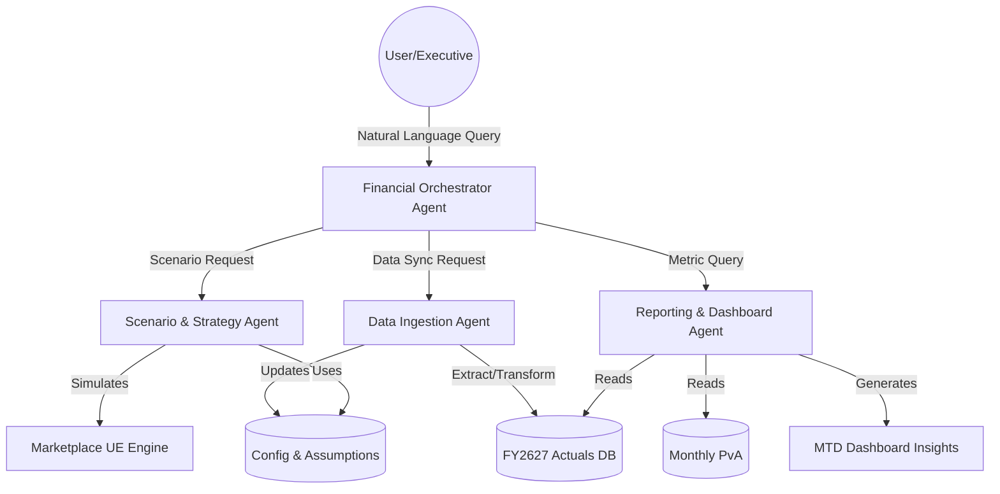

# Technical Architecture: LIIMRA Naturals UE Fuse Agent System

Based on the structure of your Unit Economics (UE) Model (`Liimra_UE_FY2627_Model_1.xlsx`), we can design a **Multi-Agent Orchestration Architecture (Fuse Agents)**. This system will automate data ingestion, perform complex financial calculations, and provide real-time scenario planning without manual spreadsheet updates.

## 1. System Overview (The "Fuse" Orchestrator)
At the center of this architecture sits the **Financial Orchestrator Agent**. It acts as the "Fuse," routing user queries, coordinating specialized worker agents, and fusing their outputs into cohesive financial insights.

## 2. Specialized Worker Agents

### A. Data Ingestion & Reconciliation Agent
*   **Target Sheets:** `📊 FY2627 Actuals`, `⚙ Config & Assumptions`
*   **Role:** Replaces manual data entry. It connects to external APIs (e.g., Shopify, Amazon Vendor Central, QuickBooks) to pull daily sales, marketing spend, and fulfillment costs.
*   **Capabilities:** Anomaly detection (flagging data inconsistencies) and automatically updating the base assumptions if macroeconomic factors (like shipping rates) change.

### B. Marketplace UE (Unit Economics) Agent
*   **Target Sheets:** `🏪 Marketplace UE`
*   **Role:** The core mathematical engine. It calculates SKU-level profitability, gross margins, and contribution margins. 
*   **Capabilities:** It holds the strict symbolic logic (Neuro-Symbolic design) to ensure math is 100% deterministic, factoring in marketplace fees, COGS, and pick/pack fees.

### C. Scenario & Strategy Agent (What-If)
*   **Target Sheets:** `🎛 What-If Model`
*   **Role:** Handles probabilistic reasoning. When a user asks, *"What if we increase Amazon ad spend by 15% next quarter?"*, this agent clones the current state, applies the changes to the UE Agent, and projects the outcomes.
*   **Capabilities:** Monte Carlo simulations and sensitivity analysis.

### D. Reporting & Variance Agent
*   **Target Sheets:** `📊 MTD Dashboard`, `📅 Monthly PvA`
*   **Role:** Fuses actuals with the baseline plan to generate variance analysis (Plan vs. Actuals). 
*   **Capabilities:** Generates natural language summaries of the MTD (Month-to-Date) performance. If actuals fall behind the plan, it autonomously queries the UE Agent to find the root cause (e.g., "Margin drop due to unexpected return rates").

## 3. Memory and Context (The Blackboard)
Instead of passing large Excel files back and forth, the architecture utilizes a **Shared Knowledge Blackboard**:
- **Structured Data:** Stored in a SQL/Time-Series database (representing the rows/columns of the Excel file).
- **Unstructured Context:** Stored in a Vector Database (representing the `📋 Documentation`, methodologies, and glossaries) so agents understand *how* to interpret the data.

## 4. Interaction Flow Example
1.  **User Prompt:** *"Why is our MTD profit margin lower than expected, and how can we fix it?"*
2.  **Orchestrator Agent** receives the prompt and delegates tasks.
3.  **Reporting Agent** checks `📅 Monthly PvA` and identifies that shipping costs are 12% over budget.
4.  **Marketplace UE Agent** isolates which SKUs or marketplaces are driving the shipping cost increase.
5.  **Scenario Agent** runs a `🎛 What-If` simulation to see the impact of raising the price of those SKUs by 5%.
6.  **Orchestrator Agent** fuses these findings into a single executive summary: *"Margin is down due to shipping costs on SKU-X. We recommend a 5% price increase, which simulations show will recover the margin without dropping demand below our target."*

> [!NOTE]
> This architecture separates the **deterministic math** (UE engine) from the **probabilistic reasoning** (Scenario Agent), which is a best practice in AI financial modeling to prevent LLM "hallucinations" on math.
